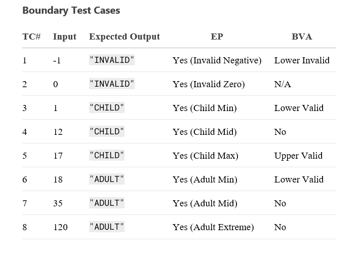

Vestel QA technical challenge
1. **A developer needs to write a function for converting age (a whole number), into life
   period using the following algorithm:**
- If age is zero, it should return INVALID
- If age is greater than zero and less than 18, function should return CHILD
  - If age is greater than or equal to 18, function should return ADULT.
    Define the optimal (effective and efficient) set of boundary test cases to test the
    function

2. **A QA engineer is performing regression testing on a software application after a bug
   fix. The engineer wants to ensure that the bug fix did not introduce new issues or
   impact existing functionalities. Which approach would be most suitable for
   regression testing?**

According to ISTQB standards, the most suitable approach for regression testing after a bug fix is:

Targeted Regression Testing with Risk Based Prioritization
1.	Impact Analysis

o	Identify modified components and their dependencies

o	Use traceability matrices to map affected functionalities

2.	Prioritize Test Cases 

o	High Priority:

	Test cases covering the fixed bug and its direct dependencies

	Critical business workflows

o	Medium Priority:

	Features sharing integration points with the modified code

o	Low Priority:

	Unaffected functionalities (may be skipped if time-constrained)

3.	Test Suite Selection

o	Re-execute:

	All tests for the fixed feature

	Sanity tests for core functionalities

o	Automate: High-priority regression tests for efficiency

4.	Partial vs. Full Regression

o	Partial Regression: If the fix is localized and low-risk

o	Full Regression: If the change impacts critical/core modules

3. **Write a query to display all OrderID where the quantity is between 5 and 15.**

   SELECT OrderID, Quantity

   FROM OrderDetails

   WHERE Quantity BETWEEN 5 AND 15

   ORDER BY OrderID, Quantity;

4. **Create a bug report based on the following scenario:**
- Access Swag Labs (saucedemo.com).
- Input a username.
- Input a password.
- 'Login' button is not visible (only on mobile devices).

Bug Report: Login Button Not Visible on Mobile Devices

Summary: Login Button Not Visible on Mobile Viewport (Responsive UI Issue)

1. Basic Information

Application: Swag Labs (saucedemo.com)

Environment:

Device: Mobile (iPhone 12, Samsung Galaxy S21)

Browser: Chrome Mobile vXX / Safari Mobile vXX

OS: iOS 15 / Android 12
Priority: High (Blocks core functionality)

Severity: Major

2. Steps to Reproduce

Open saucedemo.com on a mobile device

Enter a valid username (standard_user)

Enter a valid password (secret_sauce)

Observe the Login button is not visible or interactable

3. Expected Result

Login button should be visible and clickable after entering credentials, regardless of device

4. Actual Result

Login button is hidden, off-screen, or unresponsive on mobile viewports
Users cannot proceed to the dashboard

5. Evidence

Screenshot:
screenshot.jpg

6. Impact

All mobile users are blocked from accessing the application

Business Impact: Loss of mobile traffic and potential revenue

5. **The QA team is in the final stages of testing a critical software update scheduled for
   release in two days. The team is focused on executing comprehensive test cases,
   conducting regression testing, and ensuring that all identified issues are resolved
   before the deadline.
   Suddenly, the team receives several urgent customer requests through various
   channels such as email, support tickets, and direct phone calls.
   These requests include:**
- A critical bug reported by a high-profile customer that renders a core feature
  unusable, significantly impacting their business operations.
- A functionality enhancement request from a long-standing customer, which they
  claim is essential for their workflow efficiency and competitive edge.
- Multiple reports of intermittent performance issues from a group of enterprise
  clients who rely heavily on the software's responsiveness for their day-to-day
  operations.

With the impending release deadline, the QA team must make quick yet informed
decisions on how to prioritize these customer requests while ensuring that the ongoing
testing efforts remain on track.

How would you address this high-pressure situation and make strategic decisions
accordingly?

Strategic Response to Urgent Requests During Regression Testing

1. Prioritization
Critical Bug (P0):

Action: Isolate, replicate, and fix immediately. Pause only affected test cases

Performance Issues (P1):

Action: Investigate with metrics; add checks to current cycle if reproducible

Enhancement (P3):

Action: Document for backlog (no testing impact).

2. Ongoing Testing (Regression Testing)

Continue: 70% team runs regression on:

High-risk areas

Unaffected features (vs. P0/P1).

Automate: Smoke tests to preserve bandwidth

3. Contingencies (Maintenance Testing)
Hotfix ready for P0.

Rollback plan if performance degrades post-release.

4. Communication (Incident Management)
P0: Hourly updates.

Team: Meeting every 2 hours.

5. Outcome

Release meets 85% test coverage (critical paths validated)

P0 fixed; performance monitored post-release.

